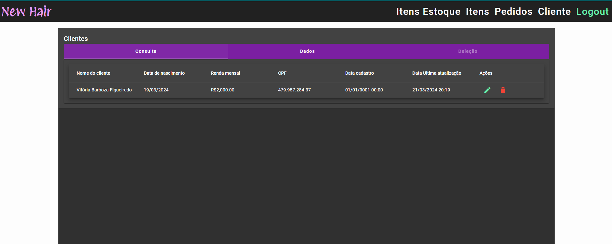

# Cliente API

API responsavel pelo gerenciamento de clientes.

## Visão geral

Esta API foi desenvolvida em C# utilizando o framework .NET Core. Ela fornece funcionalidades para gerenciamento de clientes, aplicando boas práticas de desenvolvimento contando com uma camada de autenticação em JWT.
Para testar a API, comente as '[Authorize]' notations nas controllers ou baixe também a API (JWTAuthentication)[https://github.com/NielDevSft/JWTAuthentication], e crie um usuario, uma role com o name `CLIENTE_ADM_ROLE`, e relacione os dois pelo serviço POST: (Authentication API) `/api/Usuarios/{uuid}/Roles`.

## Pré-requisitos

- Docker na versão mais atual

## Instalação

1. Clone este repositório.
2. Dentro da pasta raiz do projeto rode o comando `docker-compose up --build --remove-orphans -d`
3. Acesse (Cliente API)[http://localhost:5003/index.html]

## Contribuição

Contribuições são bem-vindas! Se você quiser contribuir com este projeto, por favor siga estas etapas:

1. Faça um fork do repositório.
2. Crie uma branch para a sua feature (`git checkout -b feature/MinhaFeature`).
3. Faça commit das suas mudanças (`git commit -am 'Adicione uma nova feature'`).
4. Faça push para a branch (`git push origin feature/MinhaFeature`).
5. Abra um Pull Request.

## Autor

[Daniel da silva Figueiredo](https://github.com/NielDevSft) - Desenvolvedor FullCycle.

## Aplicação que faz uso desta API

[Aplicação em anuglar](https://github.com/NielDevSft/empresa)

